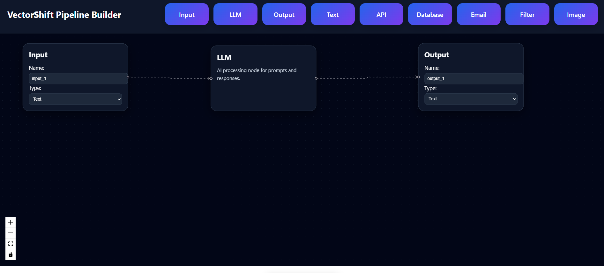

# VectorShift Technical Assessment

A modern AI workflow pipeline builder built using React, ReactFlow, Zustand, and FastAPI.

---

## Overview

This project is a drag-and-drop AI workflow pipeline builder inspired by modern no-code AI orchestration tools.

Users can create and connect nodes visually, build workflows dynamically, and validate whether the generated pipeline forms a Directed Acyclic Graph (DAG).

---

## Features

- Drag and drop pipeline builder
- Dynamic node creation
- Reusable BaseNode architecture
- Dynamic text variable handles
- DAG (Directed Acyclic Graph) validation
- Modern dark themed UI
- FastAPI backend integration
- Real-time node and edge parsing
- Multiple custom nodes

---

## Custom Nodes Implemented

- Input Node
- LLM Node
- Output Node
- Text Node
- API Node
- Database Node
- Email Node
- Filter Node
- Image Node

---

## Tech Stack

### Frontend

- React
- ReactFlow
- Zustand
- React Hot Toast

### Backend

- FastAPI
- Python

---

## Project Structure

```bash
vectorshift-technical-assessment/
│
├── frontend/
├── backend/
├── screenshots/
├── README.md
└── .gitignore
```

---

## Running Frontend

```bash
cd frontend
npm install
npm start
```

Frontend runs on:

```bash
http://localhost:3000
```

---

## Running Backend

```bash
cd backend
pip install fastapi uvicorn
uvicorn main:app --reload --port 8000
```

Backend runs on:

```bash
http://127.0.0.1:8000
```

---

## DAG Validation

The backend validates whether the pipeline forms a Directed Acyclic Graph (DAG) and returns:

- Number of Nodes
- Number of Edges
- DAG Status

Example response:

```json
{
  "num_nodes": 3,
  "num_edges": 2,
  "is_dag": true
}
```

---

## Screenshots

### Pipeline Builder UI



### DAG Validation Result


---

## Author

Adila Jaleel